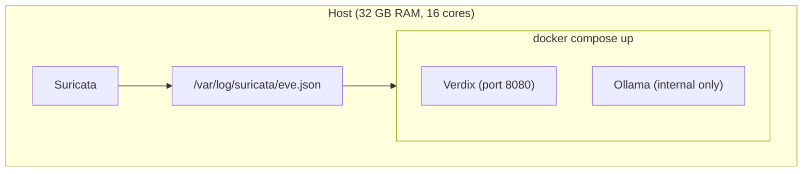
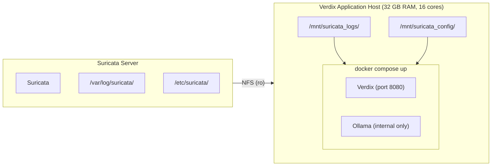
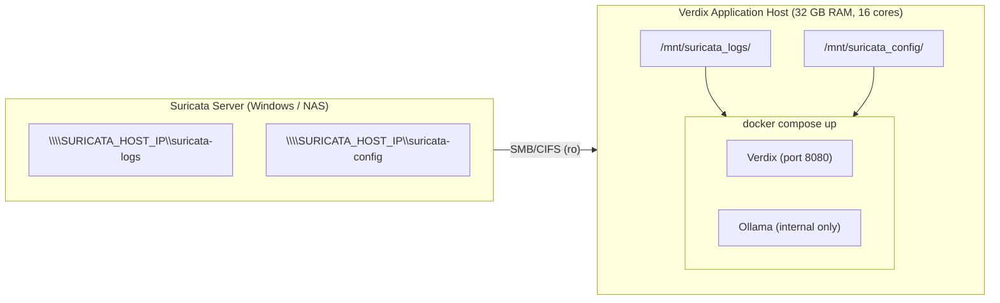

# Verdix — Deployment Guide

> **Last updated:** 2026-08-09

Verdix needs direct access to Suricata's `eve.json`. The topology you need is determined by one question: **where is Suricata running relative to this host?** Same machine, separate Linux host, or Windows host/NAS. Pick the matching section below.

---

## Before you begin

**You need:**

- A supported Linux distribution: Ubuntu 22.04 LTS+, Debian 11+, RHEL 8+, Rocky Linux 8+, AlmaLinux 8+, Fedora (current release, or the previous release), or equivalent
- Docker 24+ with Docker Compose v2 (`docker compose`, not `docker-compose`); see [Install Docker](#install-docker) if not already installed
- Suricata already running and producing `eve.json`, either on this host or a networked Suricata Server
- **32 GB RAM minimum**: the LLM runs in the sibling `llm` container, not in-process with the app. The 32 GB minimum covers both containers on one host
- **60 GB free disk space**, split across two locations that land on different filesystems if you relocate Docker storage. Measured on a clean single-partition install: ~12 GB base OS + ~33 GB after Verdix (images + volumes) — a 40 GB box lands inside the app's own low-disk warning band on first boot, so 60 GB is the real recommendation:
  - **Images** (Docker's image/layer store, `/var/lib/containerd` when the containerd image store is in use): ~11 GB actual. The LLM runtime image bundles Ollama's CUDA/ROCm runtime and is ~10.6 GB of that on its own; the app image is ~0.4 GB. Budget **15 GB minimum, 20 GB recommended** here.
  - **Volumes** (Docker's data-root): ~12 GB actual. The `verdix_models` volume holds the ~11 GB Gemma model; `verdix_data` (database, GeoIP files, enrichment cache) is small but grows over time. Budget **15 GB minimum, 20 GB recommended** here.

  If you relocate Docker storage so images and volumes land on different disks, check each location separately using the per-location budgets above; the combined 60 GB figure only applies to the default, nothing-relocated case. See the note below.

  The app's own health check (Setup screen and `/api/health`) only monitors the volumes location (15 GB min / 20 GB recommended), since it runs inside the app container, which has no visibility into Docker's image store. A green health check does not by itself confirm the images location has enough room; check that side manually before you install if you're unsure.
- **16 cores is the reference configuration; no GPU required.** Verdix admits up to 300 alerts per day; see Daily capacity below.

  Fewer than 16 cores will still run, but verdict throughput drops below what a typical deployment generates and the queue falls behind. Verdix reports queue depth when this happens. It is not a configuration we recommend.

  A GPU with 12 GB VRAM or more drops verdict time to about 30 seconds (projected, not yet measured); Ollama uses it automatically.
- **Outbound HTTPS access**, for RDAP domain lookups (runs on every alert, to the relevant TLD registry). VirusTotal, if you configure a key, also uses it. GeoIP works fully offline — the DB-IP database is embedded in the image.

**Daily capacity.** Verdix admits up to `VX_TRIAGE_DAILY_CAP` alerts per day (default 300). The count is of alerts admitted since `VX_DAILY_RESET_HOUR` (default midnight local), not of verdicts produced, so an alert that is queued, in progress, or failed consumes a slot the same as one already analyzed. Once the day's count reaches the cap, each further alert is stored with status `deferred` and is not analyzed. Deferred alerts stay visible in the queue and keep that status; Verdix does not pick them up on a later day. You can open a deferred alert and record your own disposition, but no verdict is generated for it, and deferred alerts age out with the retention window. Raise `VX_TRIAGE_DAILY_CAP` if your hardware supports more throughput; a GPU-equipped host has considerably more headroom.

**You don't need:**

- A GPU
- Any changes to your Suricata config, SIEM, or production network

> **Disk space:** if Docker's data directory is on a small root partition, move it before pulling images. See [Moving Docker storage to a larger disk](#moving-docker-storage-to-a-larger-disk) (including the containerd caveat if `docker info` reports `overlayfs` as the storage driver).

---

## Which topology is right for you?

| Your setup | Go to |
|---|---|
| Suricata and Verdix on the **same host** | [Topology 1](#topology-1-same-host) |
| Suricata on a **separate Linux host** | [Topology 2 — NFS](#topology-2-separated--nfs) |
| Suricata on a **Windows host or NAS** | [Topology 3 — SMB/CIFS](#topology-3-separated--smbcifs) |

---

## Install Docker

Skip this section if `docker compose version` already shows a version number.

**Ubuntu 22.04 LTS / Debian 12 or newer:**
```bash
curl -fsSL https://get.docker.com | sh
sudo usermod -aG docker $USER && newgrp docker
docker run hello-world
```

You should see `Hello from Docker!`

**RHEL 8+ / Rocky Linux / AlmaLinux / Oracle Linux:**
```bash
sudo curl -fsSL https://download.docker.com/linux/rhel/docker-ce.repo -o /etc/yum.repos.d/docker-ce.repo
sudo dnf install -y docker-ce docker-ce-cli containerd.io docker-compose-plugin
sudo systemctl enable --now docker
sudo usermod -aG docker $USER && newgrp docker
docker run hello-world
```

**Fedora:**
```bash
sudo curl -fsSL https://download.docker.com/linux/fedora/docker-ce.repo -o /etc/yum.repos.d/docker-ce.repo
sudo dnf install -y docker-ce docker-ce-cli containerd.io docker-compose-plugin
sudo systemctl enable --now docker
sudo usermod -aG docker $USER && newgrp docker
docker run hello-world
```

---

## Topology 1: Same-host

Suricata and Verdix run on the same machine.



### Step 1 — Download and configure

```bash
mkdir -p ~/verdix && cd ~/verdix

curl -fsSL https://raw.githubusercontent.com/verdixsec/verdix/main/docker-compose.yml -o docker-compose.yml
curl -fsSL https://raw.githubusercontent.com/verdixsec/verdix/main/example.env -o .env
```

Open `.env` and set these values:

```bash
# [REQUIRED] Password for the web UI
VX_ADMIN_PASSWORD=choose-a-strong-password

# [REQUIRED] Directory on this host containing eve.json
VX_SURICATA_LOG_DIR=/var/log/suricata

# [REQUIRED] Directory on this host containing suricata.yaml
VX_SURICATA_CONFIG_DIR=/etc/suricata

# Optional — free key at virustotal.com/gui/my-apikey
# Reputation lookup for IPs, domains, and hashes; decisive on many DNS-only alerts
VX_VIRUSTOTAL_API_KEY=
```

**Also recommended:** add a free VirusTotal API key. Verdix queries VirusTotal for the reputation of IPs, domains, and hashes in the alert. DNS-only and ambiguous-domain alerts carry little evidence of their own, so external reputation is often what decides them. Without a key, those alerts still get a verdict, and the enrichment-source ledger shows VirusTotal as not configured.

**Quota.** VirusTotal's free tier allows 500 requests per day. A single alert generates one to five lookups: up to two IP lookups (public addresses only) and up to three domain lookups drawn from correlated DNS, HTTP, and TLS events. Verdix caches every indicator result for 24 hours, so repeat sightings of the same address or domain cost nothing, and a repeated alert on the same signature and address pair within an hour skips enrichment entirely. On a first day with a cold cache and a busy sensor, 300 alerts can still approach or exceed the daily limit. When the quota is exhausted, Verdix serves the cached result and the enrichment-source ledger shows its age.

Common path variants by Suricata installation method:

| Installation | `VX_SURICATA_LOG_DIR` | `VX_SURICATA_CONFIG_DIR` |
|---|---|---|
| Package manager (apt / dnf / yum) | `/var/log/suricata` | `/etc/suricata` |
| SELKS | `/var/log/suricata` | `/etc/suricata` |
| Security Onion | `/nsm/suricata/logs` | `/etc/suricata` |
| pfSense + Suricata | `/var/log/suricata` | `/usr/local/etc/suricata` |
| Custom install | wherever `eve-log.filename` points | wherever `suricata.yaml` lives |

> Set these to directories, not filenames. Docker mounts them read-only into the container.

### Step 2 — Start

```bash
docker compose up -d
```

The first run pulls ~22 GB total: the app image (~0.4 GB) and the LLM runtime image (~10.6 GB, which bundles Ollama's CUDA/ROCm runtime), then the LLM container pulls the Gemma model (~11 GB) straight into the `verdix_models` volume. This takes 10–20 minutes depending on your connection speed. Every subsequent start is instant because the model stays in the volume.

Watch the startup:
```bash
docker compose logs -f app
```

> **Checkpoint:** you should see `eve_tailer_started` and `suricata_config_loaded` within 30 seconds of the containers coming up.

### Step 3 — Open the UI

Open `http://localhost:8080` in a browser on this host, or `http://VERDIX_HOST_IP:8080` from any machine on the same network (replace `VERDIX_HOST_IP` with this host's IP address).

> **Firewall note:** if this host has a firewall, allow inbound TCP 8080 from your analyst workstations. Replace `ANALYST_WORKSTATION_IP` with each workstation's IP address:
> ```bash
> # Ubuntu/Debian (ufw)
> sudo ufw allow from ANALYST_WORKSTATION_IP to any port 8080
> # RHEL/Rocky/Alma/Fedora (firewalld)
> sudo firewall-cmd --permanent --add-port=8080/tcp && sudo firewall-cmd --reload
> ```

Accept the EULA, then log in with the admin password you set in `.env`.

**Trigger a test alert** to confirm the pipeline is working end-to-end:

```bash
curl http://testmynids.org/uid/index.html
```

This fires `ET ATTACK_RESPONSE Id Check Returned User Id` immediately. The alert appears in the queue within 30 seconds; the LLM verdict follows in about three minutes on CPU.

---

## Topology 2: Separated — NFS

Suricata runs on a dedicated **Suricata Server**. Verdix runs on a separate **Verdix Application Host**. The Suricata Server's log and config directories are exported read-only via NFS and mounted on the Verdix Application Host.



**What this asks of the Suricata Server:** two read-only export lines in `/etc/exports`, plus one dedicated service account (`verdix`, uid 38317) added to the group that owns the Suricata log/config files. Both are additive — no existing user, file, permission, or service is modified — and both revoke in seconds (`exportfs` edit + `userdel verdix`).

---

### Step A — On the Suricata Server: export via NFS

#### A1 — Install and start the NFS server

**Ubuntu / Debian:**
```bash
sudo apt-get update && sudo apt-get install -y nfs-kernel-server
```

**RHEL 8+ / Rocky / AlmaLinux / Oracle Linux / Fedora:**
```bash
sudo dnf install -y nfs-utils
sudo systemctl enable --now nfs-server rpcbind
```

**openSUSE / SLES:**
```bash
sudo zypper install -y nfs-kernel-server
sudo systemctl enable --now nfsserver
```

> **Checkpoint:** `sudo systemctl is-active nfs-server` prints `active`.

#### A2 — Add the export entries

Replace `VERDIX_HOST_IP` with the IP address of your Verdix Application Host:

```bash
echo '/var/log/suricata  VERDIX_HOST_IP(ro,sync,no_subtree_check)' | sudo tee -a /etc/exports
echo '/etc/suricata      VERDIX_HOST_IP(ro,sync,no_subtree_check)' | sudo tee -a /etc/exports
sudo exportfs -ra
```

> **Checkpoint:** `sudo exportfs -v` lists both paths with `(ro,...)`.

If your Suricata logs or config live in non-standard paths, adjust the left side of each line. Refer to the path table in [Topology 1](#step-1--download-and-configure) for common variants.

#### A3 — Open the firewall (if applicable)

**Ubuntu / Debian (ufw):**
```bash
sudo ufw allow from VERDIX_HOST_IP to any port 2049
sudo ufw allow from VERDIX_HOST_IP to any port 111
sudo ufw reload
```

**RHEL / Rocky / AlmaLinux / Oracle Linux / Fedora (firewalld):**
```bash
sudo firewall-cmd --permanent --add-service=nfs --source=VERDIX_HOST_IP
sudo firewall-cmd --permanent --add-service=rpc-bind --source=VERDIX_HOST_IP
sudo firewall-cmd --reload
```

> Fedora Server's default firewalld zone is `FedoraServer`, not `public` (RHEL's default) — these commands don't pass `--zone`, so they land in whatever the box's default is. Syntax is identical either way; if a rule doesn't seem to apply, check with `firewall-cmd --get-default-zone`.

**No firewall or internal-only network:** skip this step.

> **Checkpoint:** from the Verdix Application Host: `nc -zv SURICATA_HOST_IP 2049` (replace `SURICATA_HOST_IP` with the Suricata Server's IP address) prints `succeeded`.

#### A4 — Create a service account for Verdix

NFS's `sec=sys` security (the default, used above) authorizes by numeric uid/gid, not by name — there's no shared directory service between the two hosts to reconcile identities otherwise. Verdix's container always runs as uid/gid 38317 (fixed — see the Dockerfile), so the Suricata Server needs one account at that same uid, in the group that owns the exported files:

```bash
sudo useradd -r -u 38317 -s /usr/sbin/nologin verdix
sudo usermod -aG "$(stat -c '%G' /var/log/suricata/eve.json)" verdix
```

The `stat` picks up whatever group actually owns `eve.json` on this install — `adm`, `suricata`, or something else entirely — so you don't need to know it in advance. If `suricata.yaml`'s owning group differs from `eve.json`'s, run the second command again against that path too.

This is purely additive: `verdix` is a new account with no login shell and no existing file, permission, or service is touched. To remove it entirely: `sudo userdel verdix`.

> **Checkpoint:** `id verdix` shows the new account in the expected group.

> **If Verdix still can't read the files after this:** `rpc.mountd` caches group membership per client and may not pick up a group change on an already-running NFS server. Force it to re-check: `sudo exportfs -f`. Skipping this step looks identical to the fix not having worked.

---

### Step B — On the Verdix Application Host: mount, configure, and start

Nothing in this step creates or changes any account on the Verdix Application Host. File access is governed entirely by the `verdix` account on the Suricata Server (Step A4) and the fixed uid/gid baked into the Verdix container image — the identity of whichever user runs `docker compose up` here is irrelevant to whether the app can read the mounts.

#### B1 — Install the NFS client

**Ubuntu / Debian:**
```bash
sudo apt-get install -y nfs-common
```

**RHEL / Rocky / AlmaLinux / Oracle Linux / Fedora:**
```bash
sudo dnf install -y nfs-utils && sudo systemctl enable --now rpcbind
```

#### Check SELinux (RHEL / Rocky / AlmaLinux / Fedora only)

RHEL 9, Rocky 9, AlmaLinux 9, and Fedora ship SELinux enforcing by default. Ubuntu and Debian use AppArmor instead — a different MAC layer, not the absence of one. Skip this section on those; it's SELinux-specific. Check:

```bash
getenforce
```

If it prints `Enforcing`: this guide's Docker CE install doesn't need the `virt_use_nfs` boolean. Its containers run unconfined as `spc_t`, not the confined `container_t` the boolean gates. (Confirmed by test on Fedora Server 44: `docker run --rm alpine cat /proc/self/attr/current` prints `spc_t`, and an NFS-backed file read succeeded with the boolean forced off.)

A Podman deployment is different — Podman confines containers under `container_t` by default. Check the boolean before mounting, and set it only if it's off:

```bash
getsebool virt_use_nfs
sudo setsebool -P virt_use_nfs on   # only if it printed 'off'
```

Don't use `:z`/`:Z` if you do hit a denial — those relabel the source path with `chcon`, but NFS mounts carry one blanket SELinux context for the whole filesystem rather than per-file labels, so `chcon` on it fails with "Operation not supported."

#### B2 — Mount and verify

Mount the exports:

```bash
sudo mkdir -p /mnt/suricata_logs /mnt/suricata_config

sudo mount -t nfs SURICATA_HOST_IP:/var/log/suricata /mnt/suricata_logs
sudo mount -t nfs SURICATA_HOST_IP:/etc/suricata     /mnt/suricata_config

ls /mnt/suricata_logs/eve.json         # should succeed
ls /mnt/suricata_config/suricata.yaml  # should succeed
```

> **Checkpoint:** both `ls` commands return the file without errors.
> - "Permission denied" → check Step A4 (service account) — this is a group/permission error, not a firewall one
> - "No such file or directory" → check the paths in Step A2
> - Mount hangs or times out → check Step A3 (firewall)

#### B3 — Make mounts survive reboots

```bash
echo 'SURICATA_HOST_IP:/var/log/suricata  /mnt/suricata_logs    nfs  ro,soft,timeo=30,_netdev  0  0' | sudo tee -a /etc/fstab
echo 'SURICATA_HOST_IP:/etc/suricata      /mnt/suricata_config  nfs  ro,soft,timeo=30,_netdev  0  0' | sudo tee -a /etc/fstab
sudo systemctl daemon-reload

# Test without rebooting
sudo umount /mnt/suricata_logs /mnt/suricata_config
sudo mount /mnt/suricata_logs && sudo mount /mnt/suricata_config
ls /mnt/suricata_logs/eve.json && echo "OK"
```

> The `_netdev` option tells the OS to wait for the network before mounting at boot. Without it, a reboot while the Suricata Server is unreachable can hang the boot sequence.

#### B4 — Download and configure

```bash
mkdir -p ~/verdix && cd ~/verdix

curl -fsSL https://raw.githubusercontent.com/verdixsec/verdix/main/docker-compose.yml -o docker-compose.yml
curl -fsSL https://raw.githubusercontent.com/verdixsec/verdix/main/example.env -o .env
```

In `.env`, point to the NFS mount paths:

```bash
VX_ADMIN_PASSWORD=choose-a-strong-password
VX_SURICATA_LOG_DIR=/mnt/suricata_logs
VX_SURICATA_CONFIG_DIR=/mnt/suricata_config
VX_VIRUSTOTAL_API_KEY=    # optional but recommended
```

#### B5 — Start

```bash
docker compose up -d
docker compose logs -f app
```

> **Checkpoint:** `eve_tailer_started` appears in the logs within 30 seconds of the containers coming up.

**If eve.json is not being read:** confirm Step A4 was completed — that's what actually grants access on NFS. The container's entrypoint logs which path it took (already readable, joined an existing group, created a new one, or failed) as a diagnostic, but it cannot grant access your NFS export doesn't already allow; see it with:
```bash
docker compose logs app
```
If the mount genuinely can't be read (Step A4 wasn't done, `exportfs -f` wasn't run after a group change, SELinux context — see the SELinux check under Step B — or POSIX ACLs beyond the owning group), the container exits at startup with a specific error naming the path, the GID, and the likely cause.

#### B6 — Open the UI

Open `http://localhost:8080` on this host, or `http://VERDIX_HOST_IP:8080` from your analyst workstation (replace `VERDIX_HOST_IP` with the Verdix Application Host's IP address).

> **Firewall note:** if this host has a firewall, allow inbound TCP 8080 from your analyst workstations. Replace `ANALYST_WORKSTATION_IP` with each workstation's IP address:
> ```bash
> sudo ufw allow from ANALYST_WORKSTATION_IP to any port 8080        # ufw
> sudo firewall-cmd --permanent --add-port=8080/tcp && sudo firewall-cmd --reload  # firewalld
> ```
> Fedora Server's default firewalld zone is `FedoraServer`, not `public` (RHEL's default) — this command doesn't pass `--zone`, so it lands in whatever the box's default is. Syntax is identical either way; if the rule doesn't seem to apply, check with `firewall-cmd --get-default-zone`.

Accept the EULA, then log in with the admin password you set in `.env`.

**Trigger a test alert** to confirm the pipeline is working end-to-end. Run this on the Suricata Server:

```bash
curl http://testmynids.org/uid/index.html
```

This fires `ET ATTACK_RESPONSE Id Check Returned User Id` immediately. The alert appears in the queue within 30 seconds; the LLM verdict follows in about three minutes on CPU.

---

## Topology 3: Separated — SMB/CIFS

Use this when the Suricata Server is a Windows host or a NAS exporting via Samba.



Replace `SURICATA_HOST_IP` with the Suricata Server's IP address or hostname.

**Check SELinux (RHEL / Rocky / AlmaLinux / Fedora only):** `virt_use_samba` ships **off** by default on Fedora Server 44 (confirmed) — unlike `virt_use_nfs`, which ships on. We haven't confirmed the default on RHEL 9, Rocky 9, or AlmaLinux 9.

Whether setting it actually changes anything for Docker CE is **unverified, not confirmed either way**: `virt_use_samba`'s policy tunable gates the same `container_runtime_domain` that `virt_use_nfs` does, and Docker CE's containers run outside that domain (unconfined `spc_t` — see the NFS topology's SELinux check). By that same reasoning this boolean is likely inert for Docker CE here too, but this topology hasn't been exercised on an SELinux-enforcing box to confirm it. A Podman deployment, which confines by default, does need it.

If you hit a denial reading the CIFS mount:

```bash
getenforce
getsebool virt_use_samba
sudo setsebool -P virt_use_samba on   # only if getsebool printed 'off'
```

Same reasoning as the NFS topology: CIFS mounts carry one blanket SELinux context for the whole filesystem, so `:z`/`:Z` won't work here either.

```bash
sudo apt-get install -y cifs-utils    # Ubuntu/Debian
# sudo dnf install -y cifs-utils     # RHEL/Rocky/Alma/Fedora

sudo mkdir -p /mnt/suricata_logs /mnt/suricata_config

# uid/gid are literal, not $(id -u)/$(id -g) — do not "simplify" this back to a
# shell substitution. CIFS has no server-side identity resolution: these mount
# options assign a single fixed owner to every file in the share as the Linux
# client sees it, and that owner must be the Verdix container's appuser (uid/gid
# 38317, fixed — see Dockerfile), not whichever account happens to run this
# mount command on the host.
sudo mount -t cifs //SURICATA_HOST_IP/suricata-logs   /mnt/suricata_logs   \
  -o ro,username=guest,password=,uid=38317,gid=38317
sudo mount -t cifs //SURICATA_HOST_IP/suricata-config /mnt/suricata_config \
  -o ro,username=guest,password=,uid=38317,gid=38317
```

Once the mounts are working, follow [Steps B4–B6](#b4--download-and-configure) from Topology 2, using `/mnt/suricata_logs` and `/mnt/suricata_config` as your paths.

> **Note:** Windows `suricata.yaml` files sometimes use backslash path separators in `include:` directives. The config reader normalises them automatically.

---

## Testing with sample traffic

To confirm the pipeline is working, run this on the Suricata Server:

```bash
curl http://testmynids.org/uid/index.html
```

This fires `ET ATTACK_RESPONSE Id Check Returned User Id` and produces an alert in `eve.json` within seconds.

For richer testing with real malware signatures (VirusTotal hits, RDAP domain data, high-confidence TP verdicts), replay a labeled PCAP through Suricata on the Suricata Server:

```bash
sudo suricata -r /path/to/sample.pcap -l /var/log/suricata/ -k none
```

**Replayed alerts appear immediately in the "Last 24h" queue view.** Verdix filters by when it received the alert, not the timestamp inside the PCAP. Historical PCAPs from weeks or months ago show up alongside live alerts without any special handling.

**Recommended source:** [malware-traffic-analysis.net](https://malware-traffic-analysis.net) provides labeled real-world PCAPs by malware family and date. These exercise the full enrichment pipeline (C2 traffic, exploit kit activity, infostealer patterns) and produce high-confidence verdicts.

---

## Health checks

Verdix exposes three health routes, one per consumer:

| Route | Consumer | Response |
|---|---|---|
| `/health` | Docker Compose's `app` healthcheck | `200 {"status": "ok"}` when ingestion is green; `503 {"status": "red", "reason": "..."}` when it's red or blocked |
| `/api/health` | Monitoring scripts, the Setup screen's own poll | `200` JSON with the full check breakdown, always — exempt from the startup gate, so a monitor can reach it even while the UI is blocked |
| `/setup/health` | The operator, in a browser | The same checks as `/api/health`, with remediation hints (file paths, the entrypoint's own diagnostics, a **Retry** button) |

`/health` backs the `app` service's Docker healthcheck. A red or blocked ingestion pipeline makes `docker compose ps` report `app` as `unhealthy` — **this is by design, not a fault.** Plain Docker Compose reports health state; it does not act on it. `restart: unless-stopped` still governs restarts, and Compose does not restart a container for failing a healthcheck the way Kubernetes or Swarm would. An `unhealthy` app that the analyst can still use is the intended state for a mid-run ingestion failure — there may be verdicts already on the dashboard worth reading, so the session stays up.

**What a red indicator means.** The queue dashboard's header shows a red "Ingestion stopped" indicator, and the health screen shows the matching state, in two distinct cases:

- **Mid-run** — the tailer has failed to read `eve.json` five or more times in a row. It keeps retrying on a widening schedule and recovers on its own the next time a read succeeds; no restart needed. The dashboard stays reachable throughout.
- **Startup-blocked** — `eve.json` or `suricata.yaml` was unreadable when the container started. Every route redirects to `/setup/health` except the health routes, static assets, and login/logout.

**Recovery from a startup block always needs a container restart.** Fixing the underlying permission or mount problem is not enough by itself: click **Retry** on `/setup/health` to confirm the paths are readable now, then run

```bash
docker compose restart app
```

Retry only re-probes both paths — it does not lift the block itself, because the group-membership fix (`entrypoint.sh`) and pipeline construction (in the app's startup lifespan) both run only at container start.

---

## Troubleshooting

**Container exits immediately:**
```bash
docker compose logs app
# Look for: VX_ADMIN_PASSWORD not set
```

An unreadable `eve.json` or `suricata.yaml` no longer exits the container. The app starts and blocks the UI at `/setup/health` instead — see [Health checks](#health-checks). If every page redirects there, that's the app reporting the problem, not a crash.

**No verdicts after 10 minutes:**
```bash
# Is the tailer reading eve.json?
docker compose logs app | grep eve_tailer

# Is Suricata producing alert events?
tail -f /your/VX_SURICATA_LOG_DIR/eve.json | grep '"event_type":"alert"'
```

**Ollama model still loading (first run only):**
```bash
docker compose logs llm
# "pulling..." → still downloading; wait for "success" before expecting verdicts
```

**VirusTotal shows NOT_CONFIGURED:**
```bash
docker compose exec app printenv VX_VIRUSTOTAL_API_KEY
# Empty output means the key is missing from .env
```

**suricata.yaml not loading:**
```bash
docker compose exec app ls /host/suricata/config/suricata.yaml
# If missing, VX_SURICATA_CONFIG_DIR points to the wrong directory
```

**Cannot reach the UI from another machine:**
The host's firewall may be blocking port 8080. See the firewall note in your topology's final step.

**NFS mounts missing after reboot:**
Ensure `/etc/fstab` entries include `_netdev`. Check `dmesg | grep nfs` for mount errors.

**`docker compose exec app id` shows root:**
That's expected and not a misconfiguration. The image no longer declares a fixed `USER`: the entrypoint starts as root to fix bind-mount permissions, then drops to `appuser` via `gosu`. `docker compose exec` opens its own session as the image's declared user (root), which is separate from the long-running app process. To see what the app itself runs as, check the process directly:
```bash
docker compose exec app cat /proc/1/status | grep -E '^(Name|Uid)'
# Expect: Uid: 38317 38317 38317 38317 (appuser). PID 1 is the app process
# itself, since the entrypoint execs into it rather than leaving a wrapper running.
```

---

## Uninstalling

Verdix is a passive observer. Removing it leaves your Suricata, SIEM, and network exactly as they were.

```bash
# Stop containers (data preserved on the named volume)
docker compose down

# Full removal — deletes all stored verdicts, dispositions, and enrichment cache
docker compose down -v
```

---

## Optional configuration

> **About `docker-compose.override.yml`:** Docker Compose automatically merges a file named `docker-compose.override.yml` with `docker-compose.yml` on every `docker compose` command; no extra flags needed. You don't need one for a standard install: `VX_SURICATA_LOG_DIR` and `VX_SURICATA_CONFIG_DIR` in `.env` already cover the NFS/SMB mount paths in Topologies 2 and 3. Create one only for a host-specific customization below (TLS-proxy CA bundle, custom GeoIP database paths) — create the file yourself and copy in the snippet from whichever section applies. It's gitignored, so updates to Verdix never overwrite it.

### Moving Docker storage to a larger disk

If your root partition has less than 60 GB free, move Docker's storage before pulling images:

```bash
# Stop Docker
sudo systemctl stop docker

# Format and mount a new disk (replace /dev/vdb and /opt with your device/path)
sudo parted /dev/vdb --script mklabel gpt mkpart primary ext4 0% 100%
sudo mkfs.ext4 /dev/vdb1
sudo mount /dev/vdb1 /opt
echo "UUID=$(sudo blkid -s UUID -o value /dev/vdb1)  /opt  ext4  defaults  0  2" | sudo tee -a /etc/fstab

# Point Docker at the new location
sudo mkdir -p /opt/docker
echo '{"data-root": "/opt/docker"}' | sudo tee /etc/docker/daemon.json
sudo systemctl start docker

# Verify
docker info | grep "Docker Root Dir"   # should show /opt/docker
```

> **containerd caveat:** if `docker info` shows `Storage Driver: overlayfs` with the containerd image store enabled, relocating `data-root` does **not** move image layers; they still land in `/var/lib/containerd` regardless of the `daemon.json` setting above. Check both locations separately:
> ```bash
> df -h $(docker info -f '{{.DockerRootDir}}')   # volumes (data-root): moved
> du -sh /var/lib/containerd                     # images: did NOT move
> ```
> Move or bind-mount `/var/lib/containerd` too if it's on the same small root partition. This has filled a root partition to 99% even after following the steps above.

### TLS-inspecting proxy

Add to `.env`:

```bash
HTTP_PROXY=http://proxy.corp.example.com:8080
HTTPS_PROXY=http://proxy.corp.example.com:8080
NO_PROXY=localhost,llm,127.0.0.1
SSL_CERT_FILE=/host/certs/ca-bundle.pem    # only if the proxy uses a corporate CA
```

Mount your CA bundle in `docker-compose.override.yml`:

```yaml
services:
  app:
    volumes:
      - /path/to/ca-bundle.pem:/host/certs/ca-bundle.pem:ro
```

### Reverse DNS (internal hostnames in verdicts)

Verdix performs reverse DNS lookups on internal IPs to resolve hostnames. Machine names appear in verdicts instead of bare IPs. This works automatically when your DNS server has PTR records for internal hosts.

To use a specific DNS server instead of the system resolver:
```bash
VX_DNS_SERVER=10.0.0.53    # your internal DNS server IP
```

To disable reverse DNS entirely:
```bash
VX_REVDNS_ENABLED=false
```

### MaxMind GeoLite2 (if you already have the databases)

Verdix ships with DB-IP Community Edition built into the image. GeoIP enrichment works out of the box with no configuration.

If your organization already uses MaxMind GeoLite2 (`.mmdb` files from another security tool), you can point Verdix at those files instead:

1. Place `GeoLite2-Country.mmdb` and `GeoLite2-ASN.mmdb` somewhere on the host (e.g. `/opt/geoip/`).
2. Add to `docker-compose.override.yml`:

```yaml
services:
  app:
    volumes:
      - /opt/geoip:/host/geoip:ro
    environment:
      VX_GEOIP_COUNTRY_DB_PATH: /host/geoip/GeoLite2-Country.mmdb
      VX_GEOIP_ASN_DB_PATH: /host/geoip/GeoLite2-ASN.mmdb
```
