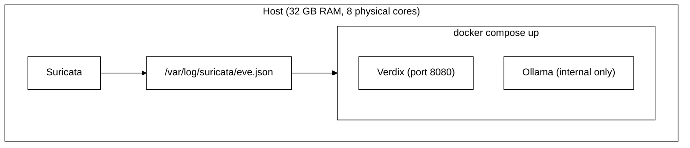
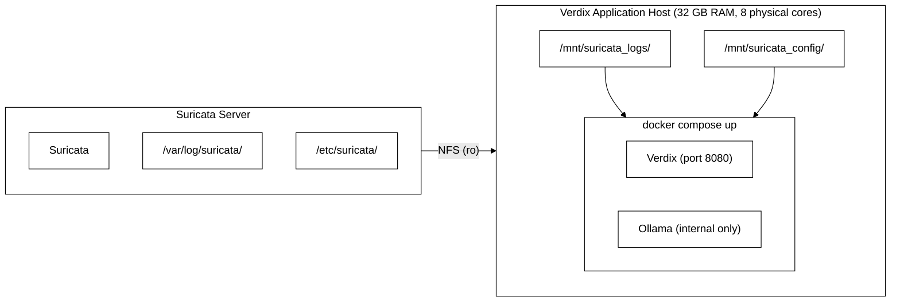
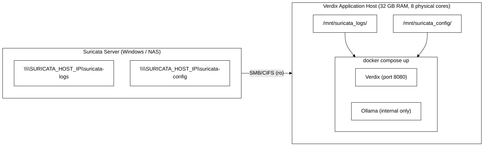

# Verdix — Deployment Guide

> **Last updated:** 2026-08-21

Verdix needs direct access to Suricata's `eve.json`. Your topology depends on where Suricata runs relative to the Verdix application host: the same machine, a separate Linux host, or a Windows host or NAS. Go to the matching section below.

---

## Before you begin

**You need:**

- A supported Linux distribution: Ubuntu 22.04 LTS+, Debian 11+, RHEL 8+, Rocky Linux 8+, AlmaLinux 8+, Fedora (current release, or the previous release), or equivalent
- Docker 24+ with Docker Compose v2 (`docker compose`, not `docker-compose`); see [Install Docker](#install-docker) if not already installed
- Suricata 8.x or newer, already running and producing `eve.json`, either on this host or a networked Suricata Server. If you don't have Suricata yet, [QUICKSTART.md](../QUICKSTART.md) installs Suricata and Verdix on one host and walks you to a populated queue using a public malware capture.
- **32 GB RAM minimum.** Covers the Verdix app and the LLM container on one host
- **30 GB free where Docker stores its data.** The containers hold the Verdix app, Ollama, and the Gemma 4 model. System health flags when less than 4 GB is free for alert-analysis storage.
- **8 physical cores (16 vCPU) recommended, no GPU required.** The health screen counts physical cores, not vCPU, so a host sized by vCPU may show a cores warning and still run fine. Fewer cores work, but verdicts fall behind and Verdix reports queue depth when they do.

  A GPU with 12 GB or more VRAM drops verdict time to under a minute. Install the NVIDIA Container Toolkit and uncomment the GPU block under the `llm` service in `docker-compose.yml`. The Setup screen's GPU check runs from the `app` container, so it may still say "No GPU detected" after you enable acceleration; check `docker compose logs llm` for the real state.
- **Outbound HTTPS** for RDAP domain lookups on every alert, and for VirusTotal if you configure a key. GeoIP runs fully offline; its database is embedded in the image.

**Daily capacity.** Verdix analyzes up to `VX_TRIAGE_DAILY_CAP` alerts per day (default 300). Alerts past the cap are stored as `deferred` and not analyzed, and Verdix does not pick them up on a later day. You can still open a deferred alert and record your own disposition. Raise `VX_TRIAGE_DAILY_CAP` if your hardware supports more throughput.

**You don't need:**

- A GPU
- Any changes to your Suricata config, SIEM, or production network

> **Disk space:** if Docker's data directory is on a small root partition, move it before pulling images. See [Moving Docker storage to a larger disk](#moving-docker-storage-to-a-larger-disk) (including the containerd caveat if `docker info` reports `overlayfs` as the storage driver).

---

## Install Docker

Install Docker on the Verdix application host: the machine that will run Verdix. In Topology 1 that is the same machine as Suricata; in Topologies 2 and 3 it is the separate host that runs Verdix, not the Suricata Server. Skip this section if `docker compose version` already prints a version.

**Ubuntu 22.04 LTS / Debian 12 or newer:**
```bash
curl -fsSL https://get.docker.com | sh
sudo usermod -aG docker $USER && newgrp docker
docker run hello-world
```

You should see `Hello from Docker!`

**RHEL 8+ / Rocky Linux / AlmaLinux / Oracle Linux:**
```bash
sudo curl -fsSL https://download.docker.com/linux/rhel/docker-ce.repo -o /etc/yum.repos.d/docker-ce.repo
sudo dnf install -y docker-ce docker-ce-cli containerd.io docker-compose-plugin
sudo systemctl enable --now docker
sudo usermod -aG docker $USER && newgrp docker
docker run hello-world
```

**Fedora:**
```bash
sudo curl -fsSL https://download.docker.com/linux/fedora/docker-ce.repo -o /etc/yum.repos.d/docker-ce.repo
sudo dnf install -y docker-ce docker-ce-cli containerd.io docker-compose-plugin
sudo systemctl enable --now docker
sudo usermod -aG docker $USER && newgrp docker
docker run hello-world
```

---

## Choosing a topology

With Docker installed, pick the section matching where Suricata runs relative to the Verdix application host. Each topology below is self-contained.

| Your setup | Go to |
|---|---|
| Suricata and Verdix on the **same host** | [Topology 1](#topology-1-same-host) |
| Suricata on a **separate Linux host** | [Topology 2 — NFS](#topology-2-separated--nfs) |
| Suricata on a **Windows host or NAS** | [Topology 3 — SMB/CIFS](#topology-3-separated--smbcifs) |

---

## Topology 1: Same-host

Suricata and Verdix run on the same machine.

**Prerequisite:** Docker installed (see [Install Docker](#install-docker) above).


```mermaid
flowchart TB
    subgraph host["Host (32 GB RAM, 8 physical cores)"]
        suricata["Suricata"] --> eve["/var/log/suricata/eve.json"]
        eve --> compose
        subgraph compose["docker compose up"]
            verdix["Verdix (port 8080)"]
            ollama["Ollama (internal only)"]
        end
    end
    classDef bw fill:#ffffff,stroke:#000000,color:#000000;
    class suricata,eve,verdix,ollama bw;
    style host fill:#ffffff,stroke:#000000,color:#000000
    style compose fill:#ffffff,stroke:#000000,color:#000000
    linkStyle default stroke:#000000,color:#000000
```

### Step 1 — Download and configure

```bash
mkdir -p ~/verdix && cd ~/verdix

curl -fsSL https://raw.githubusercontent.com/verdixsec/verdix/main/docker-compose.yml -o docker-compose.yml
curl -fsSL https://raw.githubusercontent.com/verdixsec/verdix/main/example.env -o .env
```

Open `.env` in an editor (for example `nano .env`) and set these values:

```ini
# [REQUIRED] Password for the web UI
VX_ADMIN_PASSWORD=choose-a-strong-password

# [REQUIRED] Directory on this host containing eve.json
VX_SURICATA_LOG_DIR=/var/log/suricata

# [REQUIRED] Directory on this host containing suricata.yaml
VX_SURICATA_CONFIG_DIR=/etc/suricata

# Optional: free key at virustotal.com/gui/my-apikey
# Reputation lookup for the alert's IPs and domains
VX_VIRUSTOTAL_API_KEY=
```

**Also recommended:** add a free VirusTotal API key. VirusTotal is a reputation service for indicators of compromise. Verdix checks whether the alert's IPs and domains are already known to VirusTotal, which can raise or lower the severity it assigns. Without a key, alerts still get a verdict and the ledger shows VirusTotal as not configured.

**Quota.** The free tier allows 500 requests per day. Each alert makes one to five lookups, and Verdix caches every result for 24 hours, so repeat indicators cost nothing. A busy first day with a cold cache can approach the limit; past it, Verdix serves the cached result and the ledger shows its age.

Common path variants by Suricata installation method:

| Installation | `VX_SURICATA_LOG_DIR` | `VX_SURICATA_CONFIG_DIR` |
|---|---|---|
| Package manager (apt / dnf / yum) | `/var/log/suricata` | `/etc/suricata` |
| SELKS | `/var/log/suricata` | `/etc/suricata` |
| Security Onion | `/nsm/suricata/logs` | `/etc/suricata` |
| pfSense + Suricata | `/var/log/suricata` | `/usr/local/etc/suricata` |
| Custom install | wherever `eve-log.filename` points | wherever `suricata.yaml` lives |

> Set these to directories, not filenames. Docker mounts them read-only into the container.

### Step 2 — Start

```bash
docker compose up -d
```

The first run transfers about 15 GB and unpacks to ~22 GB on disk. Depending on your connection this can take a few minutes. Every later start is quick; the model stays in the `verdix_models` volume.

Watch the startup:
```bash
docker compose logs -f app
```

> **Checkpoint:** you should see `eve_tailer_started` and `suricata_config_loaded` within 30 seconds of the containers coming up.

### Step 3 — Open the UI

Open `http://localhost:8080` in a browser on this host, or `http://VERDIX_HOST_IP:8080` from any machine on the same network (replace `VERDIX_HOST_IP` with this host's IP address).

> **Firewall note:** if this host has a firewall, allow inbound TCP 8080 from your analyst workstations. Replace `ANALYST_WORKSTATION_IP` with each workstation's IP address:
> ```bash
> # Ubuntu/Debian (ufw)
> sudo ufw allow from ANALYST_WORKSTATION_IP to any port 8080
> # RHEL/Rocky/Alma/Fedora (firewalld)
> sudo firewall-cmd --permanent --add-port=8080/tcp && sudo firewall-cmd --reload
> ```

Accept the EULA, then log in with the admin password you set in `.env`.

**Trigger a test alert** to confirm the pipeline is working end-to-end:

```bash
curl http://testmynids.org/uid/index.html
```

This fires `ET ATTACK_RESPONSE Id Check Returned User Id` immediately. The alert appears in the queue within 30 seconds; the LLM verdict follows in about two minutes on CPU.

---

## Topology 2: Separated — NFS

Suricata runs on a dedicated **Suricata Server**. Verdix runs on a separate **Verdix Application Host**. The Suricata Server's log and config directories are exported read-only via NFS and mounted on the Verdix Application Host.

**Prerequisite:** Docker installed on the Verdix Application Host (see [Install Docker](#install-docker)).


```mermaid
flowchart LR
    subgraph suricatasvr["Suricata Server"]
        s_suricata["Suricata"]
        s_logs["/var/log/suricata/"]
        s_config["/etc/suricata/"]
    end
    subgraph apphost["Verdix Application Host (32 GB RAM, 8 physical cores)"]
        m_logs["/mnt/suricata_logs/"]
        m_config["/mnt/suricata_config/"]
        subgraph compose["docker compose up"]
            verdix["Verdix (port 8080)"]
            ollama["Ollama (internal only)"]
        end
        m_logs --> compose
        m_config --> compose
    end
    suricatasvr -->|"NFS (ro)"| apphost
    classDef bw fill:#ffffff,stroke:#000000,color:#000000;
    class s_suricata,s_logs,s_config,m_logs,m_config,verdix,ollama bw;
    style suricatasvr fill:#ffffff,stroke:#000000,color:#000000
    style apphost fill:#ffffff,stroke:#000000,color:#000000
    style compose fill:#ffffff,stroke:#000000,color:#000000
    linkStyle default stroke:#000000,color:#000000
```

**What this asks of the Suricata Server:** two read-only export lines in `/etc/exports`, plus one service account (`verdix`, uid 38317) in the group that owns the Suricata log and config files. Both are additive; nothing existing is modified, and both revoke in seconds (`exportfs` edit, `userdel verdix`).

---

### Step A — On the Suricata Server: export via NFS

#### A1 — Install and start the NFS server

**Ubuntu / Debian:**
```bash
sudo apt-get update && sudo apt-get install -y nfs-kernel-server
```

**RHEL 8+ / Rocky / AlmaLinux / Oracle Linux / Fedora:**
```bash
sudo dnf install -y nfs-utils
sudo systemctl enable --now nfs-server rpcbind
```

**openSUSE / SLES:**
```bash
sudo zypper install -y nfs-kernel-server
sudo systemctl enable --now nfsserver
```

> **Checkpoint:** `sudo systemctl is-active nfs-server` prints `active`.

#### A2 — Add the export entries

Replace `VERDIX_HOST_IP` with the IP address of your Verdix Application Host:

```bash
echo '/var/log/suricata  VERDIX_HOST_IP(ro,sync,no_subtree_check)' | sudo tee -a /etc/exports
echo '/etc/suricata      VERDIX_HOST_IP(ro,sync,no_subtree_check)' | sudo tee -a /etc/exports
sudo exportfs -ra
```

> **Checkpoint:** `sudo exportfs -v` lists both paths with `(ro,...)`.

If your Suricata logs or config live in non-standard paths, adjust the left side of each line. Refer to the path table in [Topology 1](#step-1--download-and-configure) for common variants.

#### A3 — Open the firewall (if applicable)

**Ubuntu / Debian (ufw):**
```bash
sudo ufw allow from VERDIX_HOST_IP to any port 2049
sudo ufw allow from VERDIX_HOST_IP to any port 111
sudo ufw reload
```

**RHEL / Rocky / AlmaLinux / Oracle Linux / Fedora (firewalld):**
```bash
sudo firewall-cmd --permanent --add-service=nfs --source=VERDIX_HOST_IP
sudo firewall-cmd --permanent --add-service=rpc-bind --source=VERDIX_HOST_IP
sudo firewall-cmd --reload
```

> Fedora Server's default firewalld zone is `FedoraServer`, not RHEL's `public`. These commands don't pass `--zone`, so they land in the box's default zone. If a rule doesn't seem to apply, check `firewall-cmd --get-default-zone`.

**No firewall or internal-only network:** skip this step.

> **Checkpoint:** from the Verdix Application Host: `nc -zv SURICATA_HOST_IP 2049` (replace `SURICATA_HOST_IP` with the Suricata Server's IP address) prints `succeeded`.

#### A4 — Create a service account for Verdix

NFS authorizes by numeric uid/gid, not by name. Verdix's container always runs as uid/gid 38317 (fixed, see the Dockerfile), so the Suricata Server needs an account at that same uid, in the group that owns the exported files:

```bash
sudo useradd -r -u 38317 -s /usr/sbin/nologin verdix
sudo usermod -aG "$(stat -c '%G' /var/log/suricata/eve.json)" verdix
```

The `stat` picks up whatever group owns `eve.json` on this install (`adm`, `suricata`, or something else), so you don't need to know it in advance. If `suricata.yaml`'s group differs, run the second command again against that path.

This is purely additive: `verdix` is a new account with no login shell, and nothing existing is touched. Remove it with `sudo userdel verdix`.

> **Checkpoint:** `id verdix` shows the new account in the expected group.

> **If Verdix still can't read the files:** `rpc.mountd` caches group membership and may not see the group change on a running NFS server. Force a re-check with `sudo exportfs -f`. Skipping this looks identical to the fix not working.

---

### Step B — On the Verdix Application Host: mount, configure, and start

Nothing here creates or changes an account on the Verdix Application Host. Access is governed by the `verdix` account on the Suricata Server (Step A4) and the fixed uid/gid in the container image. Whoever runs `docker compose up` here does not affect whether the app can read the mounts.

#### B1 — Install the NFS client

**Ubuntu / Debian:**
```bash
sudo apt-get install -y nfs-common
```

**RHEL / Rocky / AlmaLinux / Oracle Linux / Fedora:**
```bash
sudo dnf install -y nfs-utils && sudo systemctl enable --now rpcbind
```

#### Check SELinux (RHEL / Rocky / AlmaLinux / Fedora only)

RHEL 9, Rocky 9, AlmaLinux 9, and Fedora ship SELinux enforcing by default. Ubuntu and Debian use AppArmor instead, so skip this section on those. Check:

```bash
getenforce
```

If it prints `Enforcing`: Docker CE doesn't need the `virt_use_nfs` boolean, because its containers run unconfined as `spc_t`, not the `container_t` the boolean gates.

A Podman deployment is different: Podman confines containers under `container_t` by default. Check the boolean before mounting and set it only if it's off:

```bash
getsebool virt_use_nfs
sudo setsebool -P virt_use_nfs on   # only if it printed 'off'
```

If you hit a denial, don't reach for `:z`/`:Z`: those relabel the source path with `chcon`, but an NFS mount carries one blanket SELinux context for the whole filesystem, so `chcon` fails with "Operation not supported."

#### B2 — Mount and verify

Mount the exports:

```bash
sudo mkdir -p /mnt/suricata_logs /mnt/suricata_config

sudo mount -t nfs SURICATA_HOST_IP:/var/log/suricata /mnt/suricata_logs
sudo mount -t nfs SURICATA_HOST_IP:/etc/suricata     /mnt/suricata_config

ls /mnt/suricata_logs/eve.json         # should succeed
ls /mnt/suricata_config/suricata.yaml  # should succeed
```

> **Checkpoint:** both `ls` commands return the file without errors.
> - "Permission denied" → check Step A4 (service account); this is a group/permission error, not a firewall one
> - "No such file or directory" → check the paths in Step A2
> - Mount hangs or times out → check Step A3 (firewall)

#### B3 — Make mounts survive reboots

```bash
echo 'SURICATA_HOST_IP:/var/log/suricata  /mnt/suricata_logs    nfs  ro,soft,timeo=30,_netdev  0  0' | sudo tee -a /etc/fstab
echo 'SURICATA_HOST_IP:/etc/suricata      /mnt/suricata_config  nfs  ro,soft,timeo=30,_netdev  0  0' | sudo tee -a /etc/fstab
sudo systemctl daemon-reload

# Test without rebooting
sudo umount /mnt/suricata_logs /mnt/suricata_config
sudo mount /mnt/suricata_logs && sudo mount /mnt/suricata_config
ls /mnt/suricata_logs/eve.json && echo "OK"
```

> The `_netdev` option tells the OS to wait for the network before mounting at boot. Without it, a reboot while the Suricata Server is unreachable can hang the boot sequence.

#### B4 — Download and configure

```bash
mkdir -p ~/verdix && cd ~/verdix

curl -fsSL https://raw.githubusercontent.com/verdixsec/verdix/main/docker-compose.yml -o docker-compose.yml
curl -fsSL https://raw.githubusercontent.com/verdixsec/verdix/main/example.env -o .env
```

In `.env` (edit with `nano .env`), point to the NFS mount paths:

```ini
VX_ADMIN_PASSWORD=choose-a-strong-password
VX_SURICATA_LOG_DIR=/mnt/suricata_logs
VX_SURICATA_CONFIG_DIR=/mnt/suricata_config
VX_VIRUSTOTAL_API_KEY=    # optional but recommended
```

#### B5 — Start

```bash
docker compose up -d
docker compose logs -f app
```

> **Checkpoint:** `eve_tailer_started` appears in the logs within 30 seconds of the containers coming up.

**If eve.json is not being read:** confirm Step A4 was completed; that's what grants access on NFS. The entrypoint logs which path it took (already readable, joined an existing group, created a new one, or failed), but it cannot grant access the NFS export doesn't already allow. See it with:
```bash
docker compose logs app
```
If the mount genuinely can't be read (Step A4 not done, `exportfs -f` not run after a group change, SELinux context, or POSIX ACLs beyond the owning group), the container exits at startup with an error naming the path, the GID, and the likely cause.

#### B6 — Open the UI

Open `http://localhost:8080` on this host, or `http://VERDIX_HOST_IP:8080` from your analyst workstation (replace `VERDIX_HOST_IP` with the Verdix Application Host's IP address).

> **Firewall note:** if this host has a firewall, allow inbound TCP 8080 from your analyst workstations. Replace `ANALYST_WORKSTATION_IP` with each workstation's IP address:
> ```bash
> sudo ufw allow from ANALYST_WORKSTATION_IP to any port 8080        # ufw
> sudo firewall-cmd --permanent --add-port=8080/tcp && sudo firewall-cmd --reload  # firewalld
> ```
> Fedora Server's default firewalld zone is `FedoraServer`, not RHEL's `public`. This command doesn't pass `--zone`, so it lands in the box's default zone. If the rule doesn't seem to apply, check `firewall-cmd --get-default-zone`.

Accept the EULA, then log in with the admin password you set in `.env`.

**Trigger a test alert** to confirm the pipeline is working end-to-end. Run this on the Suricata Server:

```bash
curl http://testmynids.org/uid/index.html
```

This fires `ET ATTACK_RESPONSE Id Check Returned User Id` immediately. The alert appears in the queue within 30 seconds; the LLM verdict follows in about two minutes on CPU.

---

## Topology 3: Separated — SMB/CIFS

Use this when the Suricata Server is a Windows host or a NAS exporting via Samba.

**Prerequisite:** Docker installed on the Verdix Application Host (see [Install Docker](#install-docker)).


```mermaid
flowchart LR
    subgraph suricatasvr["Suricata Server (Windows / NAS)"]
        w_logs["\\\\SURICATA_HOST_IP\\suricata-logs"]
        w_config["\\\\SURICATA_HOST_IP\\suricata-config"]
    end
    subgraph apphost["Verdix Application Host (32 GB RAM, 8 physical cores)"]
        m_logs["/mnt/suricata_logs/"]
        m_config["/mnt/suricata_config/"]
        subgraph compose["docker compose up"]
            verdix["Verdix (port 8080)"]
            ollama["Ollama (internal only)"]
        end
        m_logs --> compose
        m_config --> compose
    end
    suricatasvr -->|"SMB/CIFS (ro)"| apphost
    classDef bw fill:#ffffff,stroke:#000000,color:#000000;
    class w_logs,w_config,m_logs,m_config,verdix,ollama bw;
    style suricatasvr fill:#ffffff,stroke:#000000,color:#000000
    style apphost fill:#ffffff,stroke:#000000,color:#000000
    style compose fill:#ffffff,stroke:#000000,color:#000000
    linkStyle default stroke:#000000,color:#000000
```

Replace `SURICATA_HOST_IP` with the Suricata Server's IP address or hostname.

**Check SELinux (RHEL / Rocky / AlmaLinux / Fedora only):** `virt_use_samba` ships off by default on Fedora Server 44, unlike `virt_use_nfs`. The default on RHEL 9, Rocky 9, and AlmaLinux 9 is unconfirmed.

As with `virt_use_nfs`, this boolean is likely inert for Docker CE (its containers run unconfined as `spc_t`), though this topology hasn't been tested on an enforcing box. Podman, which confines by default, does need it.

If you hit a denial reading the CIFS mount:

```bash
getenforce
getsebool virt_use_samba
sudo setsebool -P virt_use_samba on   # only if getsebool printed 'off'
```

Same reasoning as the NFS topology: a CIFS mount carries one blanket SELinux context for the whole filesystem, so `:z`/`:Z` won't work here either.

```bash
sudo apt-get install -y cifs-utils    # Ubuntu/Debian
# sudo dnf install -y cifs-utils     # RHEL/Rocky/Alma/Fedora

sudo mkdir -p /mnt/suricata_logs /mnt/suricata_config

# uid/gid are literal, not $(id -u)/$(id -g). Do not "simplify" this back to a
# shell substitution. CIFS has no server-side identity resolution: these mount
# options assign a single fixed owner to every file in the share as the Linux
# client sees it, and that owner must be the Verdix container's appuser (uid/gid
# 38317, fixed, see Dockerfile), not whichever account happens to run this
# mount command on the host.
sudo mount -t cifs //SURICATA_HOST_IP/suricata-logs   /mnt/suricata_logs   \
  -o ro,username=guest,password=,uid=38317,gid=38317
sudo mount -t cifs //SURICATA_HOST_IP/suricata-config /mnt/suricata_config \
  -o ro,username=guest,password=,uid=38317,gid=38317
```

Once the mounts are working, follow [Steps B4-B6](#b4--download-and-configure) from Topology 2, using `/mnt/suricata_logs` and `/mnt/suricata_config` as your paths.

> **Note:** Windows `suricata.yaml` files sometimes use backslash path separators in `include:` directives. The config reader normalises them automatically.

---

## Testing with sample traffic

To confirm the pipeline is working, run this on the Suricata Server:

```bash
curl http://testmynids.org/uid/index.html
```

This fires `ET ATTACK_RESPONSE Id Check Returned User Id` and produces an alert in `eve.json` within seconds.

For richer testing with real malware signatures (VirusTotal hits, RDAP domain data, high-confidence TP verdicts), replay a labeled PCAP through Suricata on the Suricata Server:

```bash
sudo suricata -r /path/to/sample.pcap -l /var/log/suricata/ -k none
```

**Replayed alerts appear immediately in the "Last 24h" queue view.** Verdix filters by when it received the alert, not the timestamp inside the PCAP. Historical PCAPs from weeks or months ago show up alongside live alerts without any special handling.

**Recommended source:** [malware-traffic-analysis.net](https://malware-traffic-analysis.net) provides labeled real-world PCAPs by malware family and date. These exercise the full enrichment pipeline (C2 traffic, exploit kit activity, infostealer patterns) and produce high-confidence verdicts.

---

## Health checks

Verdix exposes three health routes, one per consumer:

| Route | Consumer | Response |
|---|---|---|
| `/health` | Docker Compose's `app` healthcheck | `200 {"status": "ok"}` when ingestion is green; `503 {"status": "red", "reason": "..."}` when it's red or blocked |
| `/api/health` | Monitoring scripts, the Setup screen's own poll | `200` JSON with the full check breakdown, always; exempt from the startup gate, so a monitor can reach it even while the UI is blocked |
| `/setup/health` | The operator, in a browser | The same checks as `/api/health`, with remediation hints (file paths, the entrypoint's own diagnostics, a **Retry** button) |

`/health` backs the `app` service's Docker healthcheck. A red or blocked ingestion pipeline makes `docker compose ps` report `app` as `unhealthy`. This is by design. Compose reports health state but does not act on it, so the container keeps running and the dashboard stays usable. For a mid-run ingestion failure that's the intended state: any verdicts already on the dashboard stay readable.

**What a red indicator means.** The queue dashboard's header shows a red "Ingestion stopped" indicator, and the health screen shows the matching state, in two distinct cases:

- **Mid-run:** the tailer has failed to read `eve.json` five or more times in a row. It keeps retrying and recovers on its own once a read succeeds; no restart needed. The dashboard stays reachable.
- **Startup-blocked:** `eve.json` or `suricata.yaml` was unreadable when the container started. Every route redirects to `/setup/health` except the health routes, static assets, and login/logout.

**Recovery from a startup block always needs a container restart.** Fixing the underlying permission or mount problem is not enough by itself: click **Retry** on `/setup/health` to confirm the paths are readable now, then run

```bash
docker compose restart app
```

Retry only re-probes the paths; it does not lift the block, because the group-membership fix and pipeline construction run only at container start.

---

## Troubleshooting

**Container exits immediately:**
```bash
docker compose logs app
# Look for: VX_ADMIN_PASSWORD not set
```

An unreadable `eve.json` or `suricata.yaml` no longer exits the container. The app starts and blocks the UI at `/setup/health` instead; see [Health checks](#health-checks). If every page redirects there, that's the app reporting the problem, not a crash.

**No verdicts after 10 minutes:**
```bash
# Is the tailer reading eve.json?
docker compose logs app | grep eve_tailer

# Is Suricata producing alert events?
tail -f /your/VX_SURICATA_LOG_DIR/eve.json | grep '"event_type":"alert"'
```

**Ollama model still loading (first run only):**
```bash
docker compose logs llm
# "pulling..." → still downloading; wait for "success" before expecting verdicts
```

**VirusTotal shows NOT_CONFIGURED:**
```bash
docker compose exec app printenv VX_VIRUSTOTAL_API_KEY
# Empty output means the key is missing from .env
```

**suricata.yaml not loading:**
```bash
docker compose exec app ls /host/suricata/config/suricata.yaml
# If missing, VX_SURICATA_CONFIG_DIR points to the wrong directory
```

**Cannot reach the UI from another machine:**
The host's firewall may be blocking port 8080. See the firewall note in your topology's final step.

**NFS mounts missing after reboot:**
Ensure `/etc/fstab` entries include `_netdev`. Check `dmesg | grep nfs` for mount errors.

**`docker compose exec app id` shows root:**
That's expected. The entrypoint starts as root to fix bind-mount permissions, then drops to `appuser`. `docker compose exec` opens a separate session as root, which doesn't reflect the long-running app process. Check that directly:
```bash
docker compose exec app cat /proc/1/status | grep -E '^(Name|Uid)'
# Expect: Uid: 38317 38317 38317 38317 (appuser). PID 1 is the app process
# itself, since the entrypoint execs into it rather than leaving a wrapper running.
```

---

## Uninstalling

Verdix is a passive observer. Removing it leaves your Suricata, SIEM, and network exactly as they were.

```bash
# Stop containers (data preserved on the named volume)
docker compose down

# Full removal: deletes all stored verdicts, dispositions, and enrichment cache
docker compose down -v
```

---

## Upgrading

Upgrade guidance will accompany the first published update.

---

## Optional configuration

> **About `docker-compose.override.yml`:** Docker Compose automatically merges a file by this name with `docker-compose.yml` on every command, no flags needed. A standard install doesn't need one; `VX_SURICATA_LOG_DIR` and `VX_SURICATA_CONFIG_DIR` in `.env` already cover the NFS/SMB mount paths. Create one only for a host-specific customization below (TLS-proxy CA bundle, custom GeoIP paths): create the file yourself and copy in the snippet from the relevant section. It's gitignored, so upgrades never overwrite it.

### Moving Docker storage to a larger disk

If your Docker storage location has less than 30 GB free, move it to a larger disk before installing:

```bash
# Stop Docker
sudo systemctl stop docker

# Format and mount a new disk (replace /dev/vdb and /opt with your device/path)
sudo parted /dev/vdb --script mklabel gpt mkpart primary ext4 0% 100%
sudo mkfs.ext4 /dev/vdb1
sudo mount /dev/vdb1 /opt
echo "UUID=$(sudo blkid -s UUID -o value /dev/vdb1)  /opt  ext4  defaults  0  2" | sudo tee -a /etc/fstab

# Point Docker at the new location
sudo mkdir -p /opt/docker
echo '{"data-root": "/opt/docker"}' | sudo tee /etc/docker/daemon.json
sudo systemctl start docker

# Verify
docker info | grep "Docker Root Dir"   # should show /opt/docker
```

> **containerd caveat:** if `docker info` shows `Storage Driver: overlayfs` with the containerd image store enabled, relocating `data-root` does **not** move image layers; they still land in `/var/lib/containerd` regardless of the `daemon.json` setting above. Check both locations separately:
> ```bash
> df -h $(docker info -f '{{.DockerRootDir}}')   # volumes (data-root): moved
> du -sh /var/lib/containerd                     # images: did NOT move
> ```
> Move or bind-mount `/var/lib/containerd` too if it's on the same small root partition. This has filled a root partition to 99% even after following the steps above.

### TLS-inspecting proxy

Add to `.env`:

```ini
HTTP_PROXY=http://proxy.corp.example.com:8080
HTTPS_PROXY=http://proxy.corp.example.com:8080
NO_PROXY=localhost,llm,127.0.0.1
SSL_CERT_FILE=/host/certs/ca-bundle.pem    # only if the proxy uses a corporate CA
```

Mount your CA bundle in `docker-compose.override.yml`:

```yaml
services:
  app:
    volumes:
      - /path/to/ca-bundle.pem:/host/certs/ca-bundle.pem:ro
```

### Reverse DNS (internal hostnames in verdicts)

Verdix performs reverse DNS lookups on internal IPs to resolve hostnames. Machine names appear in verdicts instead of bare IPs. This works automatically when your DNS server has PTR records for internal hosts.

To use a specific DNS server instead of the system resolver:
```ini
VX_DNS_SERVER=10.0.0.53    # your internal DNS server IP
```

To disable reverse DNS entirely:
```ini
VX_REVDNS_ENABLED=false
```

### MaxMind GeoLite2 (if you already have the databases)

Verdix ships with DB-IP Community Edition built into the image. GeoIP enrichment works out of the box with no configuration.

If your organization already uses MaxMind GeoLite2 (`.mmdb` files from another security tool), you can point Verdix at those files instead:

1. Place `GeoLite2-Country.mmdb` and `GeoLite2-ASN.mmdb` somewhere on the host (e.g. `/opt/geoip/`).
2. Add to `docker-compose.override.yml`:

```yaml
services:
  app:
    volumes:
      - /opt/geoip:/host/geoip:ro
    environment:
      VX_GEOIP_COUNTRY_DB_PATH: /host/geoip/GeoLite2-Country.mmdb
      VX_GEOIP_ASN_DB_PATH: /host/geoip/GeoLite2-ASN.mmdb
```
